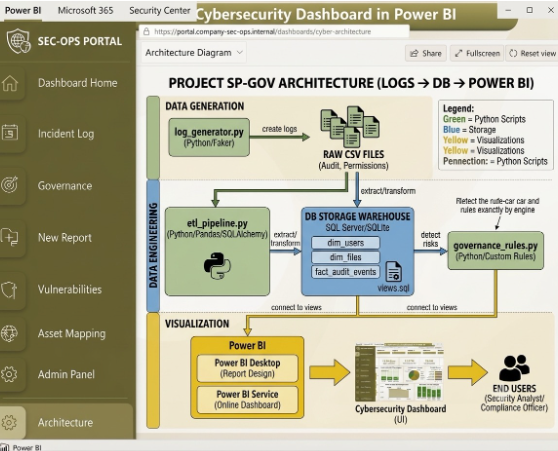
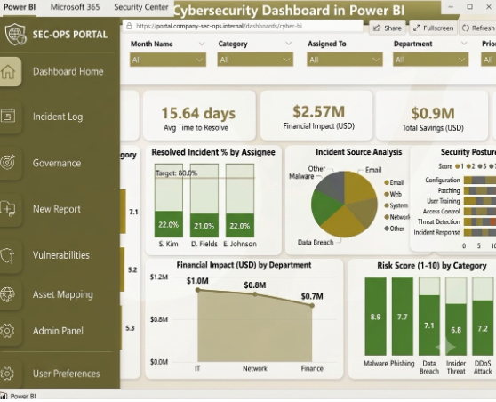

# SharePoint Governance Monitoring System

## Project Overview
This project is an automated data engineering and security analytics pipeline designed to monitor SharePoint compliance activity. It processes raw audit logs and site permission matrices, runs an ETL workflow to structure the records into a Star Schema, executes automated security analytics via SQL queries, and surfaces data-driven security insights in Power BI.

## Pipeline Architecture
1. **Data Simulation:** `log_generator.py` generates raw SharePoint audit data and permission matrices.
2. **ETL Pipeline:** `etl_pipeline.py` extracts raw logs, cleans timestamps, models fields, and loads them into a local database.
3. **Excel Bridge:** `export_to_excel.py` securely exports the structured tables to feed native Power BI connections.
4. **Analytics Engine:** `governance_rules.py` utilizes SQL logic to flag insider threat anomalies and permission exposure risks.

## Core Technologies
* **Language:** Python
* **Data Engineering & Storage:** Pandas, SQLAlchemy, SQLite
* **Analytics & Visualization:** SQL, Power BI

## Security Operations Dashboard
The structured data feeds into an enterprise-grade Power BI dashboard designed for security analysts and compliance officers to track threat vectors and anomalous activity.

### Executive Overview & Incident Monitoring

### Compliance & Risk Level Assignments
